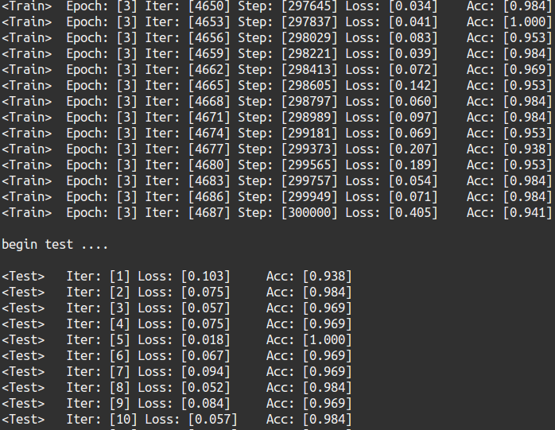
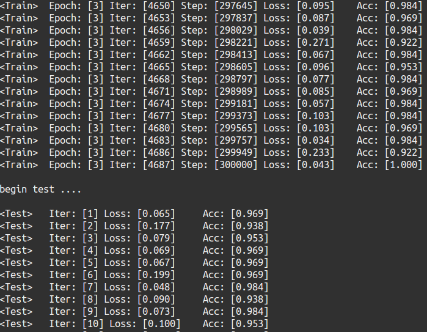

# tf_classification 基于字符级中文文本常见BaseLine汇集

针对相同[数据集](https://pan.baidu.com/share/init?surl=hugrfRu)分别采用**CNN**, **RNN**, **RNN Attention机制**进行分类

### 环境　推荐[Anaconda mini管理](https://www.jianshu.com/p/169403f7e40c)

python3.6.5 

tensorflow==1.8.0

### 项目文件.
1. data_utils.py 为数据预处理文件. 可以有`Document*Sentence*Word` 模式 和`Document*Word`模式. 预处理时采用收尾截取一定数量文本作为训练样本(总分总).
2. cnn_model.py 为cnn模型文件, 取固定句子长度. 采用`Document*Word`模式
3. rnn_model.py 为rnn`bilstm`模型文件, 每批次句子长度不固定. 采用`Document*Word`模式
4. rnn_attention.py 为rnn`gru` attention模型文件, 句子长度不固定. 采用`Document*Sentence*Word`模式
5. train_model.py 为模型加载文件, 分为公共超参数和自定义参数.
6. predict.py 为预测文件. 

### 效果比对(分为训练集和测试集)
#### cnn 

#### rnn_attention

### 参考文献及Demo

主要采用了数据集和CNN相关文档: [CNN中文文本分类Demo](https://github.com/gaussic/text-classification-cnn-rnn)

分别对字和句子进行Attention处理: [Attention机制论文](https://www.cs.cmu.edu/~diyiy/docs/naacl16.pdf)

Seq2Seq图文: [Attention机制博客](https://theneuralperspective.com/2016/11/20/recurrent-neural-network-rnn-part-4-attentional-interfaces/)

通俗易懂Attention: [Attention机制CSDN](https://blog.csdn.net/BVL10101111/article/details/78470716)

大神博客(神经网络相关): [Colah博客](http://colah.github.io)
